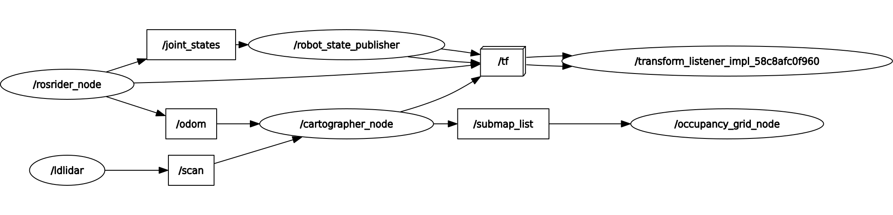

The Robot Operating System provides means to pass standardized data messages between the data processing nodes of a robot.  
Each sensor on the robot publishes its measurements on a topic in a way that can be visualized, recorded, or processed by other nodes.  
Each actuator on the robot is a subscriber. It listens for commands on a certain topic, and when a data message is sent to this topic, the actuator will start moving.  

In ROS each measurement is made using actual real physical units, such as meters per second for speed, or radians per second for angular speed.  

In the diagram below, ellipses are processing nodes found on a mobile robot running cartographer. `rosrider_node` will provide `odometry` and `joint states`, `ldlidar_node` provides lidar `scan` topic, which are both processed by `cartographer_node` which publishes to  `occupancy_grid_node`.  There is also `robot_state_publisher` that broadcasts wheel positions to `/tf` topic.  

_Fig 1: Node diagram of an autonomous mobile robot, running cartographer mapping algorithm_
  
`/tf` the transform broadcaster. This topic publishes coordinate frame transform information. All the position and orientation data related to the robot link frames are continually broadcasted in this topic. 

In ROS, there are usually more than one coordinate frames, for example `map` and `odom`.

__Next Section:__ [ROS Data Types](02_TYPES.md)
