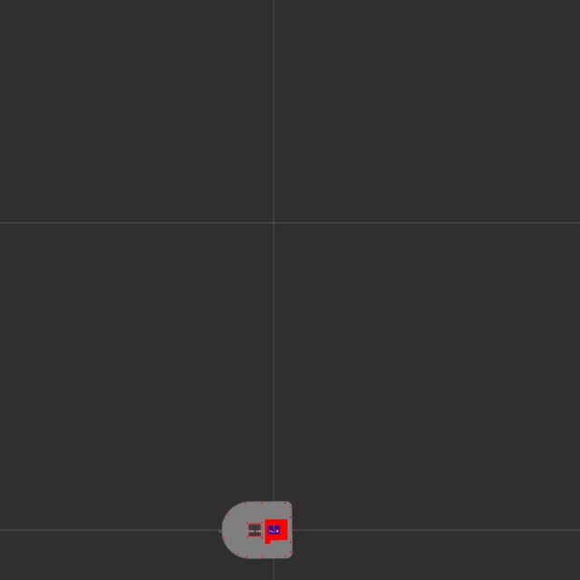

ROS abstracts the motion of a robot as linear speeds and angular speeds in x,y,z.A quadcopter can move in x,y,z and also rotate in x,y,z but 
a planar robot only moves in `linear.x` and rotates in `angular.z`

Each robot has a `/cmd_vel` listener that accepts `Twist` commands. A `Twist` velocity command is a list of linear and angular speeds that the robot must match.

Generally differential drive drivers are responsible for the `/cmd_vel` subscriber. 

The driver listens on `/cmd_vel` for `Twist` message, which is a set of speeds in `meters \ second` and `radians \ second` and interprets
for the required target speeds for each wheel, and send it to the control board.

The control board will try to match the target speeds, and report measured data on encoders, published as odometry.


The command below sets the linear speed of the robot to 0.1 `meters / second` and angular speed to 0.1 `radians / second`, making the robot follow a circular trajectory.

```
ros2 topic pub /cmd_vel geometry_msgs/msg/Twist "{linear: {x: 0.1}, angular: {z: 0.1}}" -r 20
```



This is an RVIZ visualization of the robot's data. The read arrows represent the odometry data. The green arrows represent corrected odometry data. All the data about the movement of the robot, the speed and position of the wheels are recorded.

So in short, `/cmd_vel` controls the motion of the robot. It can be supplied by a joystick, or a navigation algorithm, or a self made ROS program.


All the states of the robot are recorded, thus can be represented within a simulation environment, creating a digital twin of the robot. It is important to notice that, each velocity command is only valid for a fraction of the second, after that the robot will stop. To move the robot we must use the `--rate 20` option while using `ros topic pub`

__Next Chapter:__ [Odometry](02_ODOMETRY.md)
