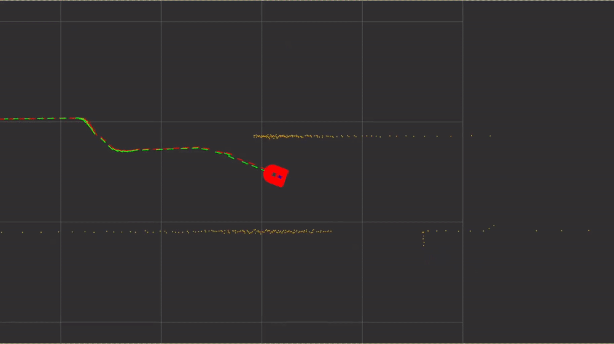

Odometry is a useful method for predicting the position of a robot after it has moved.
The prediction is accomplished by counting the number of wheel revolutions that each
wheel rotated, then converting this to motion to coordinates a global coordinate frame.
Unfortunately, this method is prone to errors from slipping, and requires perfect modeling of the system.

While this document focuses on encoder generated odometry for a small planar robot, 
Odometry can be measured with different kinds of sensors: encoders, visual, radio frequency, air or water flow. 
A visual odometry sensor is one which calculates its position based on stereographic input.

Odometry measurements from encoders are unreliable on the long time scale, but reliable on the short time scale.
There can be more than one odometry sensor in a robot, measuring within different coordinate frames.
For robust odometry data, multiple sensors of different types must be fused with `robot_localization` node to generate `/odometry/filtered`.

Each time the control board is updated, it measures the encoders. Based on these measurements, taking parameters such as pulse per revolution, gear ratio, wheel diameter, and wheel spacing we can use simple trigonometry to calculate a movement relative to the previous measurement. 

We accumulate the x and y movements in counters `pose.x` and `pose.y` and also calculate `pose.orientation` from the encoder data.
We also know how much the robot moved within a certain time interval. Using this, we calculate the actual `linear.x` and `angular.z`.

Lets look at the `odometry` message:

```
std_msgs/msg/Header header
string child_frame_id
geometry_msgs/msg/PoseWithCovariance pose
geometry_msgs/msg/TwistWithCovariance twist
```

Contains `header`, `child_frame_id`, `pose` and `twist` information.

`Header` contains `frame_id` and `timestamp`
`Pose` contains the X, Y positions and the quaternion for the orientation of the robot. 
`Twist` contains the measured linear and angular speeds of the robot. 

When we send the robot a Twist command, those are target values. The actual values are measured in and published on the odometry message. Again the measured values are in `meters / second` and `radians / second`.

Odometry can be plotted using the RVIZ program. The red arrows are the odometry data, where the green arrows are corrected odometry data. At the beginning of the video both arrows point the same location and direction, but as the robot moves errors accumulate and arrows converge. Orange points are lidar measurements.

[](https://www.youtube.com/watch?v=3ZrFwV9DIdY
)

##### Observing odometry

TODO: generate data file for verification. 1. straight line 2. rotate. then use these to generate plots below.

- [RVIZ plot of location]
- [RQT plot of measured velocities]
- [RQT plot of target velocities]

##### Verifying Odometry

- For linear speed, make the robot move 5 meters in a line. Using RVIZ, measure the movement is 5 meters.
- Verify the measured linear speed is correct from `/odom/twist/linear/x` by comparing it to `/cmd_vel/linear/x`.
- For angular speed, make the robot rotate around its own axis. Using a stop watch measure how long it takes for one rotation. You can make the robot make ten rotations, then use average. Convert the value to `radians / sec` and compare it to `/cmd_vel/angular/z`
- Verify the measured angular speed is correct from `/odom/twist/angular/z` by comparing it to `/cmd_vel/angular/z`.

##### Ground Truth Concept

A special sensor in a designated environment, such as a ceiling mounted camera and Aruco marker tags mounted on the robots can provide absolute odometry data which we call the `ground truth` data. This data can be compared with other odometry sensors outputs to validate or debug odometry sensors on robot.

##### Covariances

Odometry data must also contain the covariance matrices. Covariance matrics are important for Extended Kalman Filtering performed by `robot_localization` node. Without acceptable covariance matrices, `robot_localization` node will not generate output.

We know certain things about the robots and its sensors. For example, being a differential robot, it will never move in y direction. It will only move in x direction, and rotate around z direction. We compose the covariance matrix based on these physical constraints.

> Covariance matrix is a type of matrix that is used to represent the covariance values between pairs of elements given in a random
vector. The covariance matrix can also be referred to as the variance covariance matrix. This is because the variance of each element is represented along the main diagonal of the matrix.

> A covariance matrix is always a square matrix. Furthermore, it is positive semi-definite, and symmetric. This matrix is very useful in stochastic modeling and principle component analysis. In this article, we will learn about the variance covariance matrix, its formula, examples, and various important properties associated with it.

##### Conclusion

> No system can self validate itself without external reference of input

The robot is a moving frame, a vessel. Any intrinsic sensor mounted on it will accumulate errors as the robot moves. 
For useful localization we need an external frame of reference, as such provided by a LIDAR sensor or 3D camera.

##### References

- https://en.wikipedia.org/wiki/Odometry
- https://www.cuemath.com/algebra/covariance-matrix
- https://medium.com/@nahmed3536/wheel-odometry-model-for-differential-drive-robotics-91b85a012299

__Next Chapter:__ [Inertial Measurement](03_INERTIAL.md)
