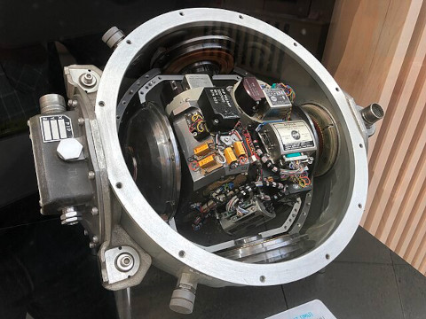
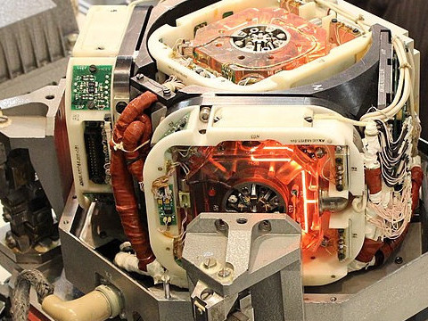
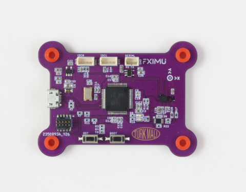
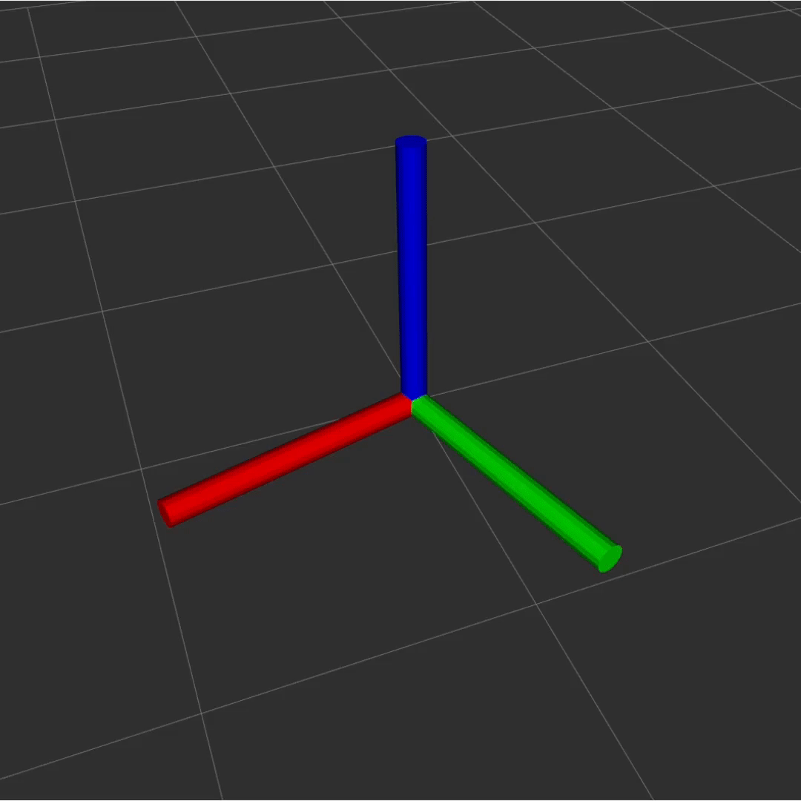
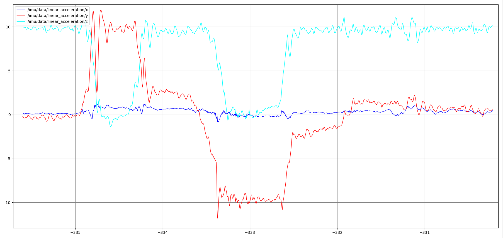
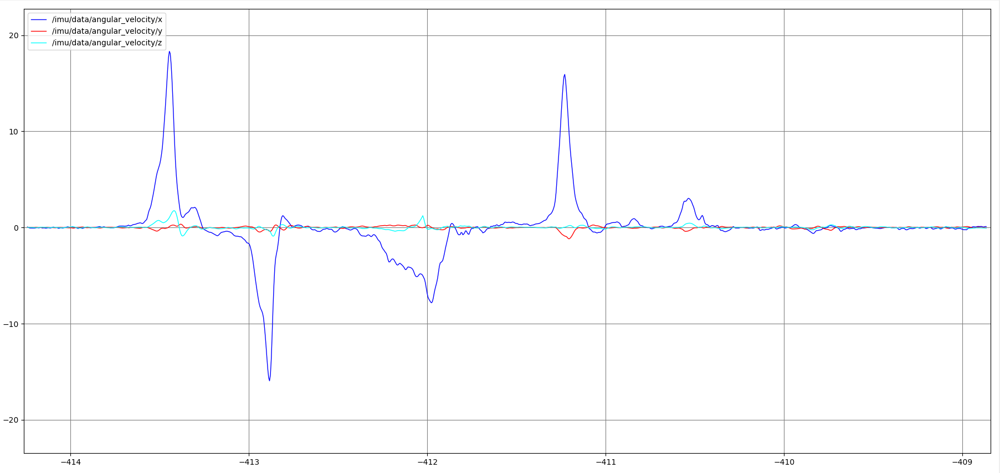

An inertial measurement unit (IMU) is an electronic device that measures and reports a vehicles's specific force, angular rate, and the orientation of the robot, using a combination of accelerometers, gyroscopes, and sometimes magnetometers.

  
*Apollo Inertial Measurement Unit* 

IMUs are typically used to maneuver modern vehicles including motorcycles, missiles, aircraft (an attitude and heading reference system), including uncrewed aerial vehicles (UAVs), among many others, and spacecraft, including satellites and landers. 

  
*Laser Based Inertial Measurement Unit* 

Recent developments allow for the production of IMU-enabled GPS devices. An IMU allows a GPS receiver to work when GPS-signals are unavailable, such as in tunnels, inside buildings, or when electronic interference is present.

  
*FXIMU Inertial Measurement Unit* 

A ROS IMU sensor perpetually measures accelerometer, gyro, and magnetometer sensors and calculates an orientation using a filtering algorithm and publishes as an `Imu` message.

Here is the `Imu` message definition

```
std_msgs/msg/Header header
geometry_msgs/msg/Quaternion orientation
geometry_msgs/msg/Vector3 angular_velocity
geometry_msgs/msg/Vector3 linear_acceleration
double[9] orientation_covariance
double[9] angular_velocity_covariance
double[9] linear_acceleration_covariance
```

- `header` field holds the timestamp and measurement frame
- `orientation` field holds a `geometry_msgs/Quaternion` object, x, y, z and w
- `angular_velocity` holds the raw gyro data in 3D: x, y, z
- `linear_acceleration` holds the raw acceleration data in 3D: x,y,z

When we say `orientation` we refer to `roll`, `pitch`, `yaw` of an object, in our case a robot. However in modern robotics this notation is no longer used because it is prone to a mathematical error known as gimbal lock. In ROS, orientations are represented as `geometry_msgs/Quaternion` message, which consists of a vector _x, y, z_ and a rotation _w_.


**Gimbal lock** is the loss of one degree of freedom in a multi-dimensional mechanism at certain alignments of the axes. In a three-dimensional three-gimbal mechanism, gimbal lock occurs when the axes of two of the gimbals are driven into a parallel configuration, *locking* the system into rotation in a degenerate two-dimensional space. This is a mathematical problem, and any algorithm using roll pitch yaw is affected by it.

##### IMUs in ROS context

An IMU sensor can output data in North-East-Down (NED) or East-North-Up (ENU) conventions.

IMU generally outputs data with *imu_link* frame_id  for Imu message and *mag_link* frame_id for the MagneticField message.
The URDF of your robot should include a mapping between *imu_link* and *base_link* and this mapping should be broadcasted on `/tf`, this way any program that reads the imu data knows its relation to robots axis.

Depending on where and which orientation the imu sensor is mounted on the robot, data transformations might be necessary.

##### Visualizing IMU data

To visualize orientation you need the `rviz-imu-plugin`. 

Start RVIZ and from left bottom of the screen click add button. Select `/imu/data` from the menu and add. From the top left of the screen, _Global Options > Fixed Frame_ to 'imu_link`. RVIZ should visualize the data as below:



##### Plotting IMU data

`ros2 run rqt_plot rqt_plot` will start the rqt_plot program. 

From the top of the window, write `/imu/data/linear_acceleration/x` in the topic box, then click add. Repeat the process for `/imu/data/linear_acceleration/y` and `/imu/data/linear_acceleration/z`. As sensor is flipped, we see that y axis goes between +/-10g. This is due to the gravity switching between different sensor axises.


_accelerometer plot in x,y,z axis while the imu sensor is flipped_

From the top of the window, write `/imu/data/angular_velocity/x` in the topic box, then click add. Repeat the process for `/imu/data/angular_velocity/y` and `/imu/data/angular_velocity/z`. As the sensor is flipped, we see a strong change in `angular_velocity/x` and not the others.


_gyro data plot of x,y,z while the imu sensor is flipped_

##### Testing IMU data for orientation

- Measure +9.81 `meters / second squared` for the Z axis.
- If the sensor is rolled +90 degrees (left side up), the acceleration should be +9.81 `meters / second squared`  for the Y axis.
- If the sensor is pitched +90 degrees (front side down), it should read -9.81 `meters / second squared` second squared for the X axis.

##### Importance of Covariances

Odometry data must also contain the covariance matrices. Covariance matrics are important for Extended Kalman Filtering performed by `robot_localization` node. Without acceptable covariance matrices, `robot_localization` node will not generate output.

#### References

https://en.wikipedia.org/wiki/Inertial_measurement_unit

__Next Section:__ [Localization](04_LOCALIZATION.md) 
