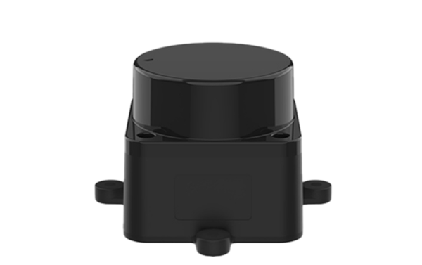

LIDAR, an acronym of "light detection and ranging" or "laser imaging, detection, and ranging" is a method for determining ranges by targeting an object or a surface with a laser and measuring the time for the reflected light to return to the receiver. Lidar may operate in a fixed direction (e.g., vertical) or it may scan multiple directions, in which case it is known as lidar scanning or 3D laser scanning, a special combination of 3D scanning and laser scanning. Lidar has terrestrial, airborne, and mobile applications.
 

  
_An animated view of 3D lidar data_  

  
_LDLidar, a popular and inexpensive sensor_  

#### References

https://en.wikipedia.org/wiki/Lidar

[LIDAR videp]
[RVIZ lidar visualization]

__Next Section:__ [SLAM](06_SLAM.md) 
