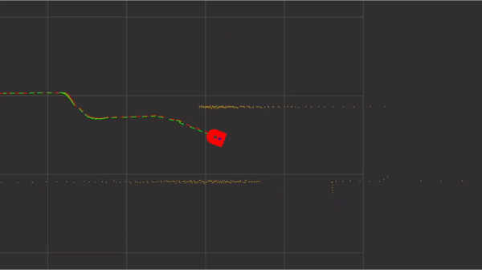

- [Command Velocity](01_COMMAND.md)
- [Odometry](02_ODOMETRY.md)
- [Inertial Measurement](03_INERTIAL.md)
- [Localization](04_LOCALIZATION.md)
- [LIDAR](05_LIDAR.md)
- [SLAM](06_SLAM.md)
- [Cartographer](07_CARTOGRAPHER.md)
- [Navigation](08_NAVIGATION.md)
- [Image Processing Pipelines](09_IMAGE.md)

__Next Chapter:__ [Programming in ROS Environment](../03_PROGRAMMING/README.md)
